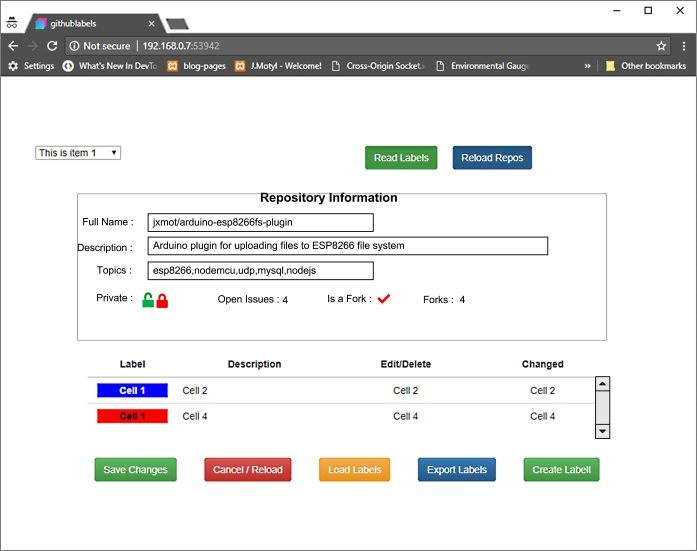
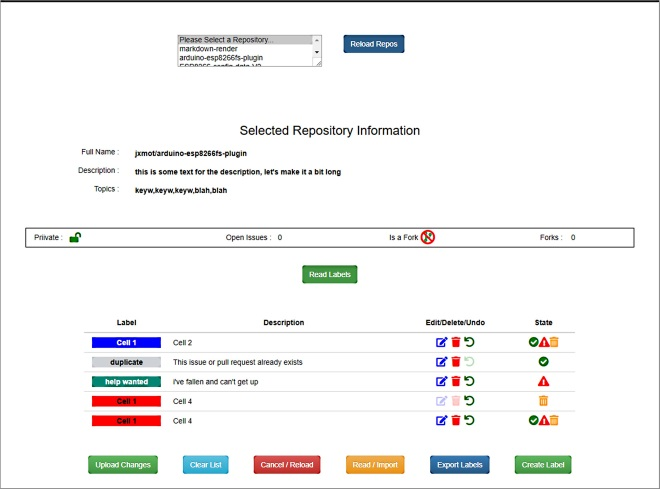

# github-label-manager

**NOTE: This project is currently a "work-in-progress". And will be in various states between "working" and "not working". The master branch will not necessarily be the most current.**

**2013-04-10 : Label file export/import and row marking (as imported) is working, needs additional testing and
integration of imported labels into other operations.**

**2013-03-31 : Basic label retrieval from a repo, label edit, undo, and mark for deletion are working.**

**Major To Do's : label deletion from repo, label upload to repo, new label creation**

A web based utility to manage GitHub labels.

# History

GitHub is a great tool, and I appreciate all the work that has gone into it. But lately I've been using *issues* on my repositories to note bugs, enhancements, etc. And I like the fact that I can use *labels*. However, it would have been *really nice* to make the labels global in respect to the repositories. For example there is a group of 4 or 5 labels that I would like to use *everywhere*. And getting them to each of the desired repositories is no effortless task! So, this is what I came up with....

# Overview

This utility will provide - 

* A means to :
    * Edit labels in a fashion similar to how it's done on GitHub
    * Save a repository's labels to a JSON file
    * Load labels from JSON files and upload the labels to a repository
    * Import additional labels to a label list
    * *TBD*
    
This application is not intended to be deployed for *multi-user* scenarios. It is intended to assist an *individual* in the task of managing GitHub issue labels across a number of repositories. Each user(*repository owner/collaborator*) will require their own separate installation of this application. This application can be hosted either locally or on an Internet accessible web server. However the latter is *not recommended* unless sufficient security has been implemented.

Label data files can be shared between users. Those files do not contain and GitHub user or repository information. However in situations where label data files are automatically saved the file names will contain a repository name.

All data files are kept on the server where the application is ran from. They will be found in the `./data` folder.
    
## Initial GUI Design

*A wireframe is your friend....* and time is well spent making one. And *Mock ups* are a good alternative.

This was my initial pass at putting together a GUI for this application - 

  

Then after some thought and making adjustments I ended up with this -

  

Changes included - 

* Made the repository selection box *resizeable*
* Moved a button, added more at the bottom of the page
* Worked out how I want the repository information to be presented.
* Reworked the label area, decided to use icons for action selection and label state indication

## Defining the Operation

Now that I had my mock-up I could begin finalizing how the application was going to operate. It was also an opportunity at this point to make additional adjustments to the GUI.

But before I started on *operations* I had to come up with some *rules*. These rules help define some of the operations and their associated indicators. Here are some examples - 

* Repository lists will be saved automatically and reused during run-time rather than reacquire the list from GitHub.
* When a repository's label list is read it is saved(*backed up*) automatically *with a time stamped file name*.
* Labels can have the following operations done to them - 
    * Edit - change the label's characteristics
    * Delete - marks the label for deletion, changes to the repository or exporting require confirmation. If the label is new(ID is null) then it is removed from the list immediately
    * Undo - to last state or undelete to last state 
* Labels can be in one of four states - 
    * Unchanged - 
        * label is new and empty
        * has just been retrieved
        * has just been saved or uploaded
    * Edited
    * Marked for deletion
    * New - ID is null, OR'd with "Unchanged" and "Edited" only, "Delete" removes the label from the list immediately and **cannot be undone**.
* Label Actions - 
    * Entire list -  
        * "Upload Changes" or "Export Labels" -  
            * What ever is displayed in the list will be either(depending on user choice) uploaded to the selected repository (if one was selected) or saved to a JSON formatted file.
        * "Clear List" - list is emptied and all label references are reset
        * "~~Cancel /~~ Reload" - list is emptied and all label references are reset, labels are reloaded from the most recent *source*.
        * "~~Read /~~ Import" - import from file only, 
* List of Labels - sorted alphabetically by label text (*GitHub returns them already sorted*)

### Application States

* Initial - 
    * Successful start up -  
        * Repository selection list is populated, nothing is selected
            * Retrieve repository list using the configured GitHub repository owner and access token
            * Save all data to a JSON formatted file (overwrite)
            * Fill selection list with each repository's "`name`"
        * Repository information fields are empty or hidden
        * Label list is empty
        * Enable buttons - 
            * "Reload Repos", "Read / Import", "Create Label"
        * Disable buttons - 
            * "Read Labels", "Upload Changes", "Clear List", "Cancel / Reload", "Export Labels"
    * Start up failure at any point - 
        * Display error message, no controls visible
        

* A repository was picked - 
    * Show repository information -
        * Retrieve specific items for the chosen repository from [the saved file|internal storage]
    * Enable buttons - 
        * "Read Labels", "Reload Repos", "Read / Import", "Create Label"
    * Disable buttons - 
        * "Upload Changes", "Clear List", "Cancel / Reload", "Export Labels"
        

    * Check label list - 
        * Empty - do nothing
        * 1 or more labels - 
       

* "Read Labels" was clcked - 
    * Check label list - 
        * Empty - do nothing, continue
        * 1 or more labels - 
            * Prompt for "Keep / Merge" or "Clear" - save choice
    * Display labels for the selected repository
        * Retrieve label list
        * Display labels - 
            * Act on previous choice (if made) - 
                * Clear - remove previous labels from the list
                * Keep / Merge - 
                    * Matching Criteria - 
                        * IDs match - overwrite previous
    * Enable buttons - 
        * "Read Labels", "Reload Repos", "Read / Import", "Create Label"
    * Disable buttons - 
        * "Upload Changes", "Clear List", "Cancel / Reload", "Export Labels"
        
# JSON Data 

## Configuration `_gitlabels.json`

## Repository Information

## Label List

# Task List & Development Status

**x** - complete 
**i** - in progress 
**b** - blocked 
**n** - no further work is needed 

- [x] Begin development of core functions - get all repos, get labels for a repo, get info for a specific repo
    - [x] Initial design, code and test
    - [x] Design, code and debug test framework *Note: this task is ongoing during app development*
    - [x] Integrate with test framework *Note: this task is ongoing during app development*
    - [i] Final design, code and test
    - [ ] Document in source and externally
- [i] Develop additional core functions - create label, edit label, delete label, update label
    - [x] Initial design, code and test - based on initial core functionality effort
    - [x] Integrate with test framework *Note: this task is ongoing during app development*
    - [i] Label Functions - 
        - [x] edit
        - [x] undo
        - [x] mark for deletion
        - [i] create
- [i] Additional functions - upload labels to repo, export labels to file, import labels from file
    - [ ] Initial design, code and test - based on initial core functionality effort
        - [i] Save/Load non-repo related label files from an alternative location
        - [i] Create API function to retrieve label file names and info (date, size, ???)
    - [n] Integrate with test framework *Note: this task is ongoing during app development*
- [i] Develop app-state processing for enable/disable controls code
- [x] Create page for testing functionality of core functions - *ongoing development*
- [x] Update README along the way - *in progress*

Other things to do along the way - 

- [ ] For all functions - 
    - [i] Comment
        - [ ] Synopsis
    - [i] Revisit return data layout, make "`ret`" more meaningful.
    - [ ] Revisit HTTP header, specifically status
    - [ ] 
- [ ] Investigate implementing "profiles" - 
    - [ ] Method to specify a profile
    - [ ] Security
- [i] Cosmetic - 
    - [x] Adjust label text color vs background

* Miscellaneous "nice to haves" :
    - [ ] Add issue counts to individual labels in list
        - [ ] Restrict label actions based on use count. **Run a test with current code and labels that are attached to issues**
    - [ ] Add "stars" to repo info box

