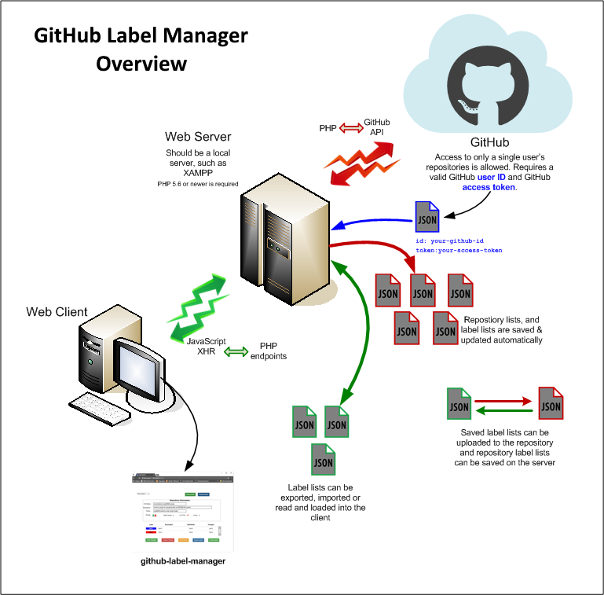

# github-label-manager Design Details

# Design Overview

<p align="center">
  
</p>

# Front End

## API Groups

* GitHub Label Manager Client API
* GUI - Repository API
* GUI - Labels API

### Label Manager Client API

Access to the Web Client API is provided in `glmapi.js` - 

**`createlabel(label, callback)`**<br>
Create a *new* label in the currently selected repository.

**`exportdata(data, callback)`**<br>
Export data (*typically a JSON formatted string*) to a client-side specified file name.

**`importlist(callback)`**<br>
Retrieve a list of previously exported label files. The path is configured in `ghlabelmgr.php`, see `$imexportpath`.

**`getimportlabels(file, callback)`**<br>
Retrieve the labels from a specified file.

**`getlabels(repo, callback)`**<br>
Retrieve the labels from a specified repository.

**`getrepos(callback)`**<br>
Retrieve a list of repositories for a specified GitHub user. Also saves the list in the file `/data/_username-repos.json`. Currently a maximum of 100 repositories can be returned. A modification to allow for all of a user's repostories will need to be made. See <https://developer.github.com/v3/guides/traversing-with-pagination/>

**`getrepoinfo(repo, callback)`**<br>
Retrieve information for a specific repository. 

The functions above are wrappers around GET and POST requests. And depending on the desired request the functions above will call - 

* `_get(func, args, callback)` - 
* `_post(func, body, callback)` - 

#### Client API Responses

An API response is returned as a JSON string and contains - 

```
{
    "error": true OR false,
    "ret": 0 = no error, >0 = meaning depends on function, <0 = error level,
    "msg": Textual messages for errors, otherwise a JSON string
}
```

For example, a successful `GET getlabelfiles` might respond with - 

```
{"error":false, "ret":4, "msg":["file_1.json","file_2.json","file_3.json","file_4.json"]}
```

An error from `GET getimportlabels.php?f=no-file.json` where `no-file.json` does not exist would appear as -

```
{"error":true, "ret":-1, "msg":"no-file.json does not exist"}
```

#### Error Levels

Error levels are contained in `ret` and can range from -1 to any reasonable negative number. The exact values and their meanings are related to the API call. However the proximity of value to zero indicates how close to success the API call was.

**NOTE :** All API calls respond with `HTTP/1.0 200 OK` in the header regardless of the sucess or failure of the API call. 

## DOM Usage

Within this application the DOM is quite dynamic. It is altered when ever a repository or labels are rendered on the page. 

### Dynamic Element IDs

The following elements will have their `id` attributes created when the element themselves are added to the DOM -

* Table Rows - `<tr>` : when associated with a label
* List Items - `<li>` : when associated with label export/import files
* Some Spans - `<span>` : when associated with a label's *action icons* or *state icons*

### Dynamic Element Events

Although it would be possible to attach events to the *dynamic element IDs*, it would also be extremely difficult to maintain and/or debug. Instead, and where click events are needed those click-able elements use the tag's `onclick="func()"` attribute. To identifiy the specific element its `id` will be passed as an argument - 

```
  <div onclick="func(this.id)"></div>
```

### Dynamic Element Data Storage

#### Label Data

#### Label State

#### Label Type

#### Label Appearance

#### Notes

* When storing JSON formatted *strings* in `data-????` attributes you need to be consistent in regards to the method used for saving **and** retrieving the JSON string. I have found that everything works best when using `document.getElementById('someID').dataset.item` *instead of* the JQuery form `$('#someID').data('item')`. That's because JQuery will parse the JSON string and `$('#someID').data('item')` will actually return an object. 

## Label Editing

### Modal

### Data Storage

### Detecting Change

## Styling


# Back End

The back end of this application provides the endpoints for the application. They have been tailored to this application in regards to how the data is formatted and its contents in *both* directions.

In addition all JSON file creation and storage is also on the back end.

## PHP Endpoints

All of the endpoints have been implemented with PHP (*5.6*) and behave as *commands*. And all GitHub specific details are also kept there. Those details are - 

* repository owner's ID
* access token
* GitHub endpoint paths

### API Synopses

#### Repository Functions

#### Label Functions

## JSON Data Files

## Configuration


